## Git

### O que é o Git?
Git é um software de versionamento, ou seja, um software que guarda informações sobre o seu projeto num estado específico.

### Por que preciso disso?
Basicamente para controle. Um software de versionamento mantém registros de cada modificação feita no seu projeto, o que significa que, caso algum erro seja cometido no desenvolvimento, é possível retornar para um estado anterior do seu projeto e comparar com versões anteriores, o que auxilia na solução do problema.

### Como ele funciona?
O Git armazena os dados do seu projeto numa base de dados especial, em que cada estado do seu projeto é representado por um __commit__.

Esses estados são chamados de _snapshots_, que são fotografias do seu projeto num momento específico. É dessa forma que o Git consegue recriar o seu projeto caso seja necessário retornar a um estado anterior, o Git simplesmente pega a foto do seu projeto naquele ponto anterior e mostra pra você como era o seu projeto, mostrando arquivos que talvez não existam mais e deixando de mostrar arquivos que foram criados em estados posteriores àquele.

Cada __commit__ ou _snapshot_ é indicada por uma chave, que é como se fosse o nome da foto. Assim, quando é necessário retornar o projeto para aquele momento, basta dizer ao Git esse nome que ele cuida do resto.

__site oficial:__ https://git-scm.com/

### Instalação
#### Onde eu acho o arquivo de instalação?
Para instalar, procure na seção de Downloads ou clique <a href="https://github.com/git-for-windows/git/releases/download/v2.23.0.windows.1/Git-2.23.0-64-bit.exe">aqui</a> para baixar a versão 2.23.0 64 bits para Windows.

#### Processo de instalação
Pode ser um simples "next next next ...", mas tem alguns detalhes interessantes que podem ser alterados para aproveitar melhor a ferramenta.

1. __Default Editor__
É interessante, __mas não obrigatório__, colocar como editor padrão o Git na sua ferramenta de edição de código (seja lá qual for, VSCode, PyCharm, Notepad++, etc.). Facilita o uso dos comandos já que, muito provavelmente, é por lá que os projetos serão feitos e controlados.

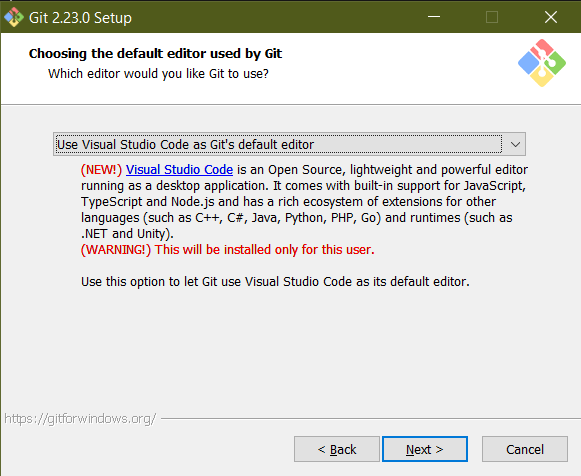

2. __Adição do Git no PATH__
Colocar o Git na variável de ambiente PATH significa que o usuário pode usar os comandos de qualquer terminal (cmd, PowerShell, etc.). Recomendo usar o Git Bash (o terminal que é instalado com o Git) porque é mais parecido com terminal do Linux (os comandos são diferentes do terminal padrão do Windows).

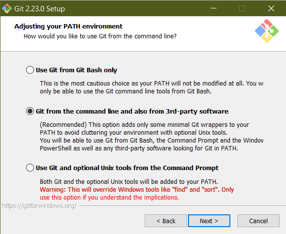

O restante é next, next, next ...

## Comandos Básicos:

### git init
Cria a estrutura de controle de versão no diretório atual. Também pode ser usado especificando o diretório no formato:

>`git init path`

### git add \<file1\> \<file2\> ...
Adiciona arquivos na pilha de __commit__. Costuma-se dizer que esses arquivos estão __staged__.
Para adicionar todos os arquivos do diretório o comando pode ser especificado no formato:

>`git add .`

### git reset \<file1\> \<file2\> ...
Remove arquivos que foram colocados na pilha de __commit__. Para remover todos os arquivos, basta escrever o comando:

>`git reset` (sem o ponto)

### git commit -m "Fix/Add/Remove something something"
Cria o __commit__ no [__branch__](#git-branch-name) atual. Um __commit__ é uma foto do estado atual dos arquivos que estavam na pilha (que estavam __staged__). É dessa forma que o Git grava as informações do projeto.

Quando uma mensagem curta não é descritiva o suficiente das alterações é recomendado escrever um pequeno parágrafo sobre o __commit__ no formato:

> git commit -m "Fix/Add/Remove something something
>
> This paragraph describes the changes made  
> more in-depth to the project.

#### Mensagens de commit
É uma boa prática escrever títulos de até 50 caractéres (legibilidade do log) com o formato:
__\<Ação\> \<Objeto\> \<Local\>__

__Ação:__ O que você fez? Correção, Adição, Remoção (evite "modificação", por exemplo, que não transmite logo de cara o conteúdo do __commit__, prefira um dos três primeiros);

__Objeto:__ Em que você fez? função xyz, mensagem abc (evite longas descrições, deixe elas para o corpo do __commit__ e não para o cabeçalho)

__Local:__ Aonde você fez? Pode até ser omitido dependendo da situação, mas para funções ou códigos mais longos separados por seções pode ser útil apontar aonde está a mudança;

### git branch \<name\>
Cria um novo branch com nome __\<name\>__.  

Quando um projeto é iniciado, é como marcar um ponto de partida e plantar uma semente de uma árvore. Conforme seu projeto cresce, você __incrementa__ arquivos, __acrescenta novos__ arquivos, pastas, etc. e cada etapa de desenvolvimento que termina é marcada por um __commit__ (um objeto da árvore).  

Assim, um __branch__ (galho) é uma ramificação do projeto, uma forma de __apontar__ (selecionar) um __commit__ específico, sendo que o branch default é o __master__, que não tem nada de especial por ter esse nome, ele é criado com o início do diretório do Git, ou seja, quando você executa o comando

>`git init`

e, na maioria das vezes, ninguém muda o nome dele.  

Cada projeto possui diferentes necessidades de __workflow__, mas é comum adotar a estrutura de branches a seguir:

| __Nome do branch__   | __Descrição__                               |
| ------------------   | ------------------------------------------- |
| `master`             | branch de produção                          |
| `dev` ou `staging`   | branch de desenvolvimento de novas features |
| `topics` ou `issues` | branch de solução de problemas              |

#### Então o que acontece quando eu crio um novo branch?
Você está apenas criando outro apontador de __commits__ para se movimentar pela árvore do seu projeto. Isso é útil para criar diferentes estados do projeto, por exemplo um branch de __staging/desenvolvimento__, outro de __prod__ (que geralmente é o __master__) e, caso necessário, __topic branches__ para solução de bugs do projeto relatados pelos usuários.

#### Como o git sabe para qual branch ele tem que olhar?
Existe outro __apontador__ que é o mestre de todos os branches chamado de __HEAD__, que é quem decide qual branch está comandando o estado atual do projeto que você enxerga.

#### Ok, mas ainda não entendi a utilidade disso tudo:
O melhor cenário para entender isso é pensar num projeto grande e você precisar comandar seu único branch __master__ entre seus __commits__ de __staging__, __prod__ e quaisquer outros. Você teria que procurar o __commit__ toda vez que quisesse mudar para algum estado específico do projeto e então reverter os estados ou fazer um checkout... enfim, é algo trabalhoso. Com os __branches__, você pode usá-los como se fossem marcadores de página ou índices do seu projeto. Além disso, é possível ramificar alterações a partir de qualquer ponto da árvore do projeto para desenvolver novas features sem alterar o estado de produção estável.
Assim, quando necessário, basta trocar o __HEAD__ para o branch desejado (que terá um nome intuitivo ao invés de um hash muito doido) para navegar pela árvore do seu projeto até pontos de interesse.

### git merge \<branch_name_1\> \<branch_name_2\> ...
Uma das formas de juntar dois ou mais __branches__ (também chamados __histories__) ao __branch__ atual.  
Um exemplo visual que ajuda a entender uma situação de __merge__ é a seguinte:
Digamos que seu __branch__ de produção está no estado __D__ e, paralelamente, você esteve trabalhando na solução de um bug desde a versão __B__:

>
>            E---F---G   iss#1
>           /
>      A---B---C---D     master
>

Então na versão __G__ do bug você resolveu o problema de forma estável e está confiante em associar as mudanças ao __branch__ de produção na versão __D__. Para isso você executa o comando __git merge iss#1__ com o __HEAD__ do projeto no __master__. Assim a árvore do projeto deverá resultar em:

>
>            E---F---G    iss#1
>           /         \
>      A---B---C---D---H  master
>

### git rebase \<branch_name_1\> \<branch_name_2\> ...
Outra forma de integrar mudanças de um ou mais __branches__ ao __branch__ atual.
Diferente do commando __merge__, o comando de __rebase__ reconstrói o projeto para unificar ramificações, ou seja, ao invés de juntar mudanças feitas em dois ramos em um estado novo como foi visto no comando de __merge__, o comando de __rebase__ irá recriar a árvore do projeto desde o ponto de ramificação e irá criar uma nova estrura linear com todas as mudanças.

Um exemplo visual que ajuda a entender a situação de __rebase__ é a seguinte:
Digamos que seu __branch__ de produção está no estado __D__ e, paralelamente, você esteve trabalhando na solução de um bug desde a versão __B__:

>
>            E---F---G   iss#1
>           /
>      A---B---C---D     master
>

Então na versão __G__ do bug você resolveu o problema de forma estável e está confiante em associar as mudanças ao __branch__ de produção na versão __D__. Para isso você executa o comando __git rebase iss#1__ com o __HEAD__ do projeto no __master__. Assim a árvore do projeto deverá resultar em:

>
>                    E---F---G    iss#1
>                   /
>      A---B---C---D              master
>

Dessa forma, reestrutura-se o projeto como se o __branch iss#1__ fosse integrado ao projeto a partir do __commit D__

### merge VS. rebase
Não existe uma resposta óbvia sobre qual usar, mas, em geral, opta-se por fazer __merges__ em estruturas de projeto mais simples em que não há muitas ramificações e __branches__ paralelas muito longas.

Por outro lado, __rebase__ pode ser utilizado para simplificar a árvore do projeto para melhorar a legibilidade do histórico de __commits__

## Comandos Auxiliares:
### git status
Mostra o estado do projeto: qual é o branch, se existem arquivos não rastreados, quais arquivos estão na fila de __commit__, etc.
Pode ser usado especificando o caminho do diretório também:

> `git status path`

### git log
Mostra o histórico de __commits__, o hash de cada __commit__, autor, data e mensagem. O hash é o código único do __commit__, que é o que permite com que o sistema consiga retornar a uma versão anterior do projeto usando o próximo comando.

### gitk --all
Abre uma janela mostrando toda a história do projeto. É parecido com o __git log__, mas permite escolher __commits__ específicos e também fornece uma visão da árvore do projeto não apenas como uma lista de __commits__.

### git stash
Digamos que você precise alternar entre __branches__, mas não quer dar __commit__ no trabalho do __branch__ atual ainda. Neste caso, você cria um __stash__ das suas mudanças, ou seja, você cria uma pilha de trabalho inacabado para poder mudar de __branch__ sem perder suas alterações e sem ter que fazer um __commit__ com alterações incompletas.

## GitHub

__GitHub__ é uma plataforma de hospedagem de projetos que utiliza o __Git__. Pense nele como um _Dropbox_ ou _Google Drive_ especial para projetos de programação.

__site oficial:__ https://github.com

### Aplicativo Desktop:

O GitHub tem também um aplicativo que pode ser instalado no Desktop e pode ser baixado clicando <a href="https://central.github.com/deployments/desktop/desktop/latest/win32">aqui</a>. A instalação é bem simples, o executável dá conta de tudo, não precisa nem de next, next, next, ...

Assim que terminar de instalar, o aplicativo abre na página inicial pedindo que você entre na sua conta ou que crie uma se você ainda não tem.

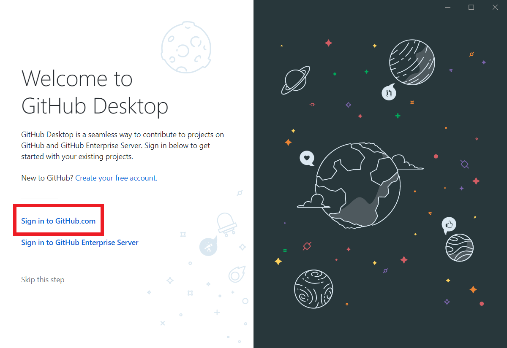

Depois de entrar na sua conta, uma janela perguntando como você quer se identificar nos seus __commits__ vai aparecer.

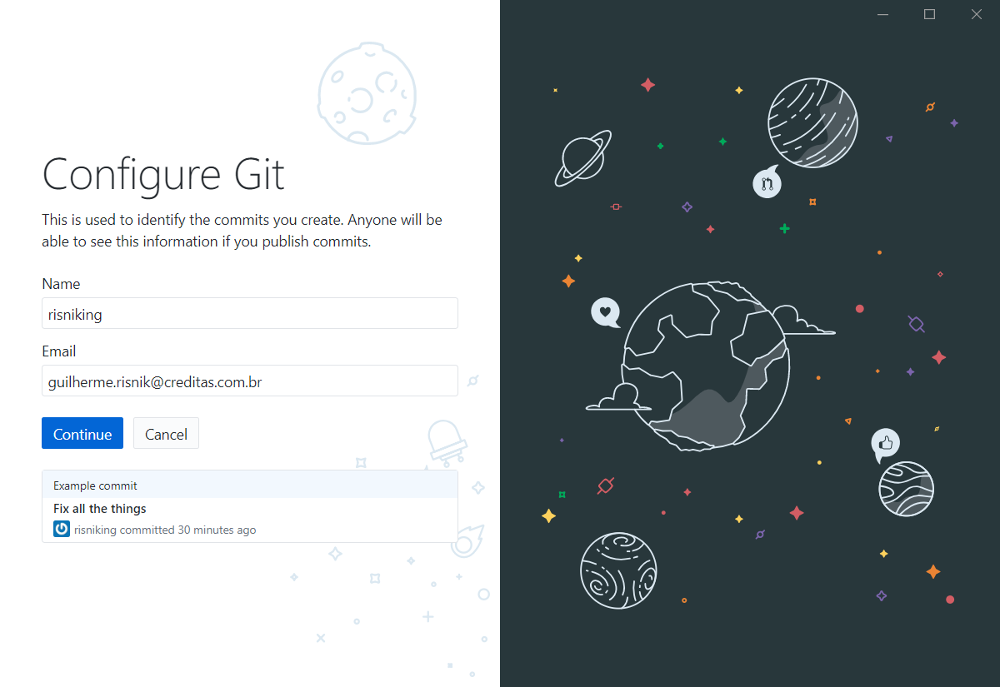

Finalmente você será redirecionado para a página de criação e gerenciamento de [repositórios](#repositório-repo).

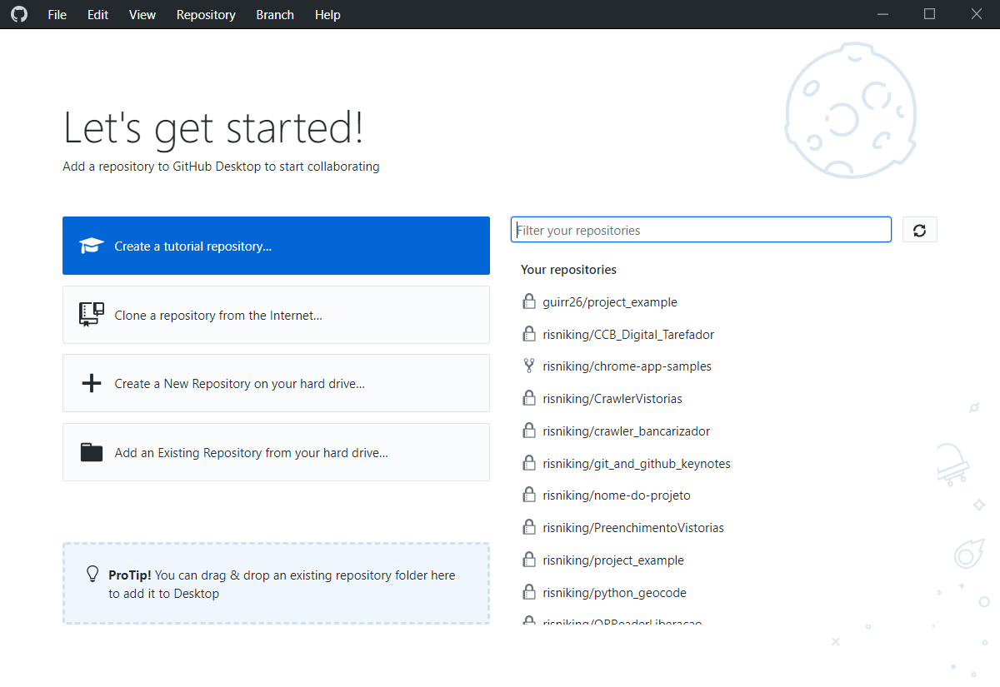

### Repositório (Repo):

Um repositório do GitHub funciona como diretório raiz do seu projeto, pense nele apenas como uma pasta na nuvem.

#### Arquivos comuns de todo repo:

##### README:

Um arquivo com informações sobre o projeto. Deve conter o que seu projeto faz ou deveria fazer, instruções de instalação, enfim, precisa conter informações mínimas para quem quiser usar seu projeto ou dar manutenção.

##### .gitignore:

Arquivo contendo uma lista dos arquivos que devem ser ignorados pelo seu projeto. Geralmente aqui estarão arquivos de build do código ou quaisquer outros que não sejam essenciais para a execução dele.

#### Como criar um repositório:

##### Pelo site github.com:

Na página inicial do GitHub, no canto superior direito (ao lado da sua foto ou ícone da sua conta), tem um botão `+`. Clicando nele, escolha a opção __New repository__

Na página de criação do repositório, insira um nome para o ele (em geral é o nome do seu projeto) e na seleção de privacidade, altere o valor padrão para __Private__. Quando terminar clique no botão __Create repository__.

Se tudo der certo você deverá ver a página do seu novo repositório.

##### Pelo aplicativo Desktop:

Para criar um repositório clique no botão __Create a New Repository on your hard drive...__ e forneça um nome e um local para criar o diretório na sua máquina.

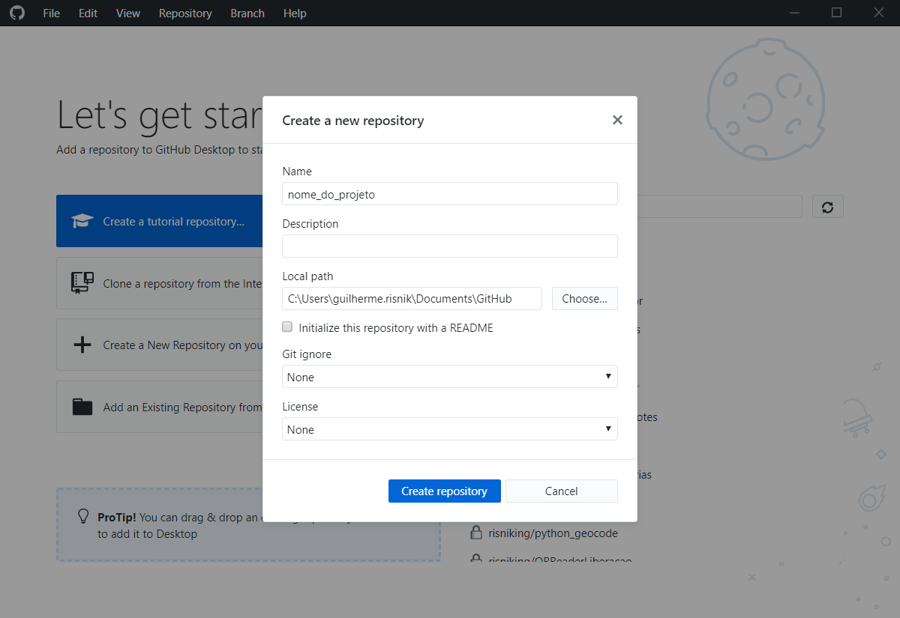

Assim que terminar de criar, você verá a página abaixo e verá uma recomendação do GitHub para publicar seu projeto na nuvem

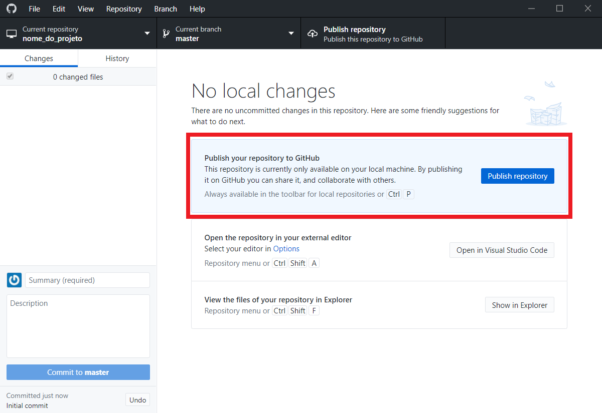

Clicando no botão __Publish repository__ uma página irá abrir, apenas clique novamente em __Publish repository__ e seu repositório será criado na nuvem e associado à essa pasta na sua máquina.

#### Criando um branch:

Por padrão, quando você cria um repositório ele já vem com o __`master` branch__, que, em geral, é utilizado como o __branch__ de produção.

##### Pelo site github.com:

Na página do repositório do seu projeto, clique no botão da lista de __branches__ escrito `Branch: master`.

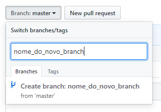

Isso fará com que a lista de __branches__ abra. No caso, como o repositório é novo, só existe o `master`. Para criar um novo __branch__, basta inserir um nome que ainda não exista (em geral os nomes serão sempre os mesmo, como `staging`, `features`, `issue#247`, etc.).

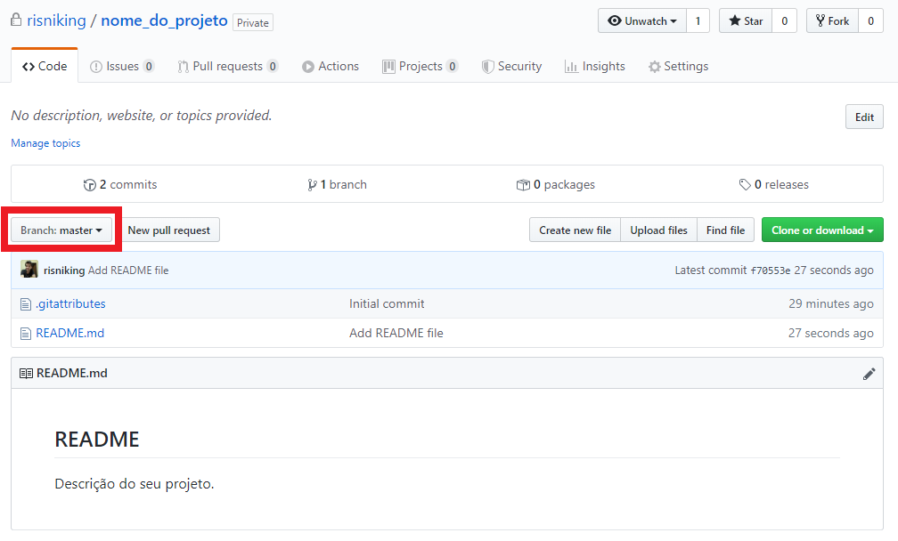

Termine clicando em `Create branch: nome_do_novo_branch`. Automaticamente o repositório será trocado para a visão deste novo __branch__. Agora, quando quiser trocar entre __branches__, basta clicar na lista e selecionar outro.

##### Pelo aplicativo Desktop:

Da mesma forma que fizemos pelo site, clique no botão da lista de __branches__ escrito `Current branch master` na parte superior do aplicativo.

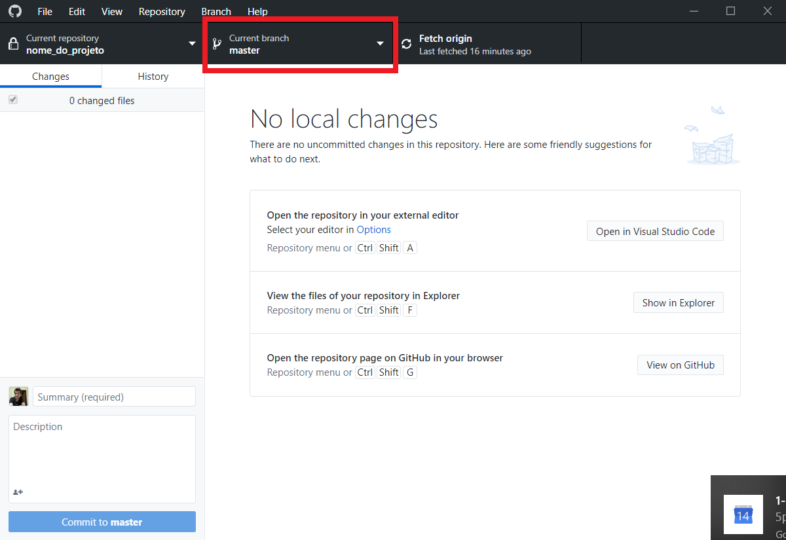

Assim, a lista de __branches__ do projeto irá aparecer. Para criar um novo __branch__, clique no botão `New branch`.

#### Fazendo um commit:

##### Pelo site github.com:

Digamos que você fez uma alteração em um ou mais arquivos do seu projeto e quer fazer um __commit__ dessas mudanças. Para isso, basta clicar em `Upload files`

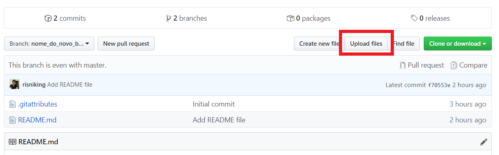

Na página seguinte, arraste os arquivos que quer dar __commit__ ou clique em `choose your files` para selecioná-los.

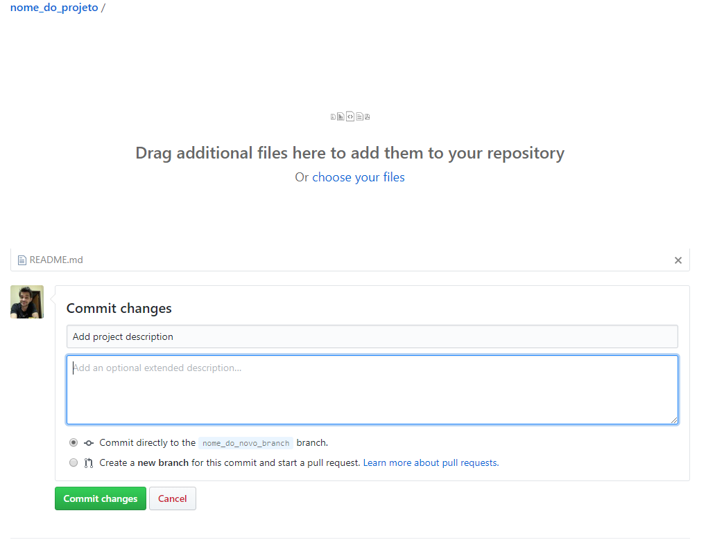

Acrescente uma mensagem ao seu __commit__ e, caso considere necessário, adicione um parágrafo descrevendo as modificações feitas. Finalize clicando em `Commit changes`.

##### Pelo aplicativo Desktop:

O aplicativo mostra todas as mudanças feitas em todos os arquivos do seu projeto, sem a necessidade de adicionar os arquivos manualmente para __commit__. Mesmo assim, é possível selecionar quais arquivos farão parte do seu __commit__ (pode ser que você tenha feita diversas mudanças, mas cada uma merece um __commit__ diferente, com uma mensagem e descrição diferentes).

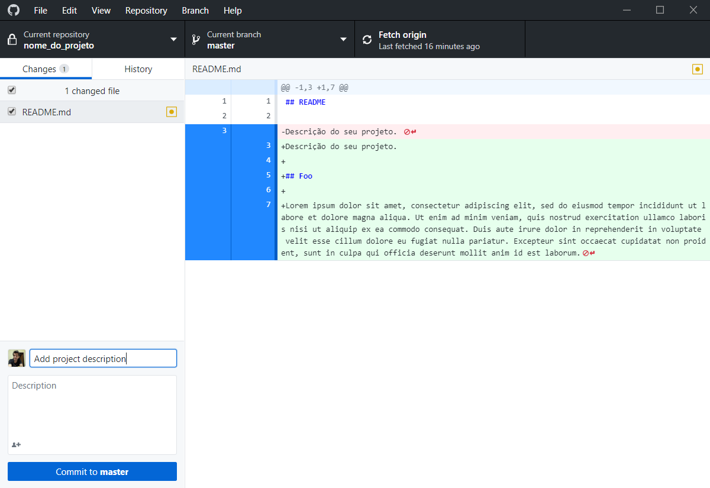

Note que o __branch__ selecionado é o `master`, então o botão de __commit__ indica a mensagem `Commit to master`. Atente-se a isso quando fizer modificações e __commits__, pois, em geral, novas features são desenvolvidas e adicionadas num __branch__ separado (_features_, _testes_, _staging_, etc.). Depois de validadas e seu projeto se mostrar estável com as mudanças, elas são adicionadas no `master`, que é o seu __branch__ de produção.

# Rascunho (ignorar por enquanto)

### Git vs Github:

Não são a mesma coisa.

Github é um site, um serviço que usa Git.

Git é um sistema de versionamento independente do Github. Você pode usar Git e armazenar seu código no google drive, por exemplo. O versionamento é feito pelo Git e o armazenamento é feito pelo drive.

O Github é um serviço que facilita o uso do Git porque acrescenta um front-end ao Git, mostrando número de __commits__, versões, mudanças em arquivos, entre outros.
